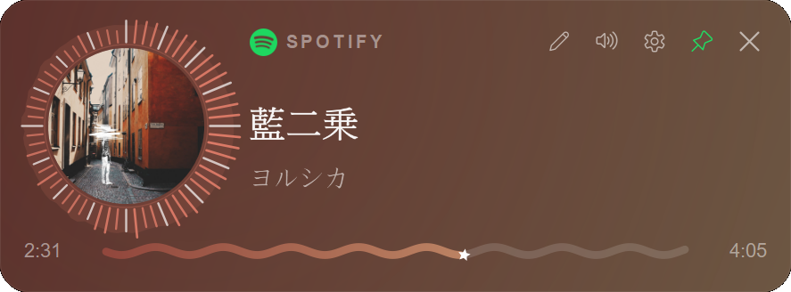
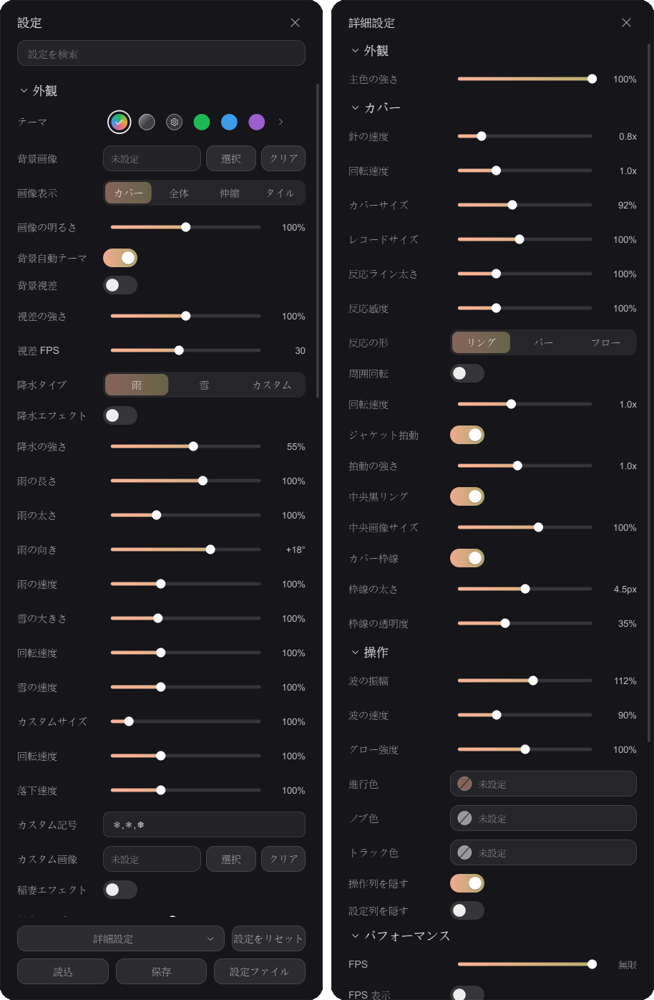

[日本語](README.md) | **繁體中文**

# Spotify Mini

桌面迷你播放器，**不需要 Spotify API**。透過 Windows 媒體傳輸控制（SMTC）讀取並遙控
Spotify 桌面版，也支援瀏覽器等其他媒體來源。封面主色自動上色、全自繪 UI、時間基準動畫，
追求高 FPS 與低 CPU 佔用。

<p align="center">
  
</p>

## 特色

- 讀取目前播放的歌曲、封面、進度，並可遙控上一首／下一首／播放暫停／隨機／循環／音量。
- 來源可選 Spotify、瀏覽器或自動挑選正在播放的工作階段。
- 主題：封面自動取色、玻璃透明、自訂漸層、固定色票或雙色漸層。
- 大量視覺特效（封面視覺化、波浪進度條、降水特效等）與可調 FPS。
- 即時縮放、圓角、字體、動畫強度切換；語言支援繁中與日文，目前沒有英文支援。
- 系統匣常駐、單一實例、編輯模式自由排版。

<p align="center">
  
</p>

## 系統需求

- 建議 Windows 11；Windows 10 可執行但部分功能可能較不穩定。
- 安裝 Spotify 桌面版（播放需求；DRM 在客戶端，無法不開 Spotify 播歌）
- 從原始碼執行需 Python 3.11 – 3.14（開發環境為 3.14）

## 從原始碼執行（uv）

```bash
# 安裝 uv（若尚未安裝）
powershell -c "irm https://astral.sh/uv/install.ps1 | iex"

# 取得程式碼
git clone https://github.com/lancealan0121/spotify_mini.git
cd spotify_mini

# 建立虛擬環境並安裝相依套件
uv venv
uv pip install -r requirements.txt

# 執行
uv run python main.py
```

亦可直接用 `run.bat`（會執行 `python main.py`）。

## 打包成單一執行檔

```bash
build.bat
```

會以 PyInstaller 產生 `dist\MiniSP_<日期>.exe`（首次執行會自動安裝 PyInstaller）。

## 授權

本專案以 [MIT License](LICENSE) 釋出。

Spotify 為 Spotify AB 的商標，本專案與 Spotify AB 無任何隸屬或背書關係；
`spt.png` 商標素材僅作來源標示之用。
